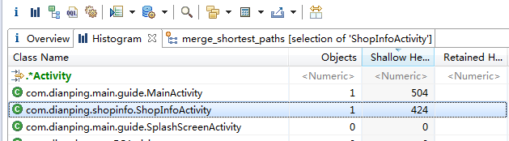
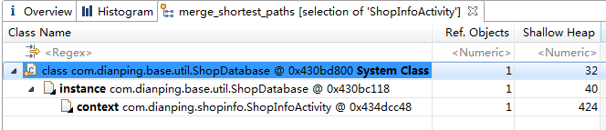
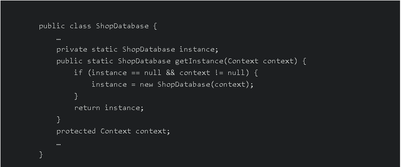

# Android内存泄漏研究(转)
>* 非常好的一篇文章，厚着脸皮转载了

## 概念

### 根搜索算法

Android虚拟机的垃圾回收采用的是根搜索算法。GC会从根节点（GC Roots）开始对heap进行遍历。到最后，部分没有直接或者间接引用到GC Roots的就是需要回收的垃圾，会被GC回收掉。

根搜索算法相比引用计数法很好的解决了循环引用的问题。举个例子，Activity有View的引用，View也有Activity的引用，之前我还尝试去源代码里找Activity何时和View断开连接是大错特错了。当Activity finish掉之后，Activity和View的循环引用已成孤岛，不再引用到GC Roots，无需断开也会被回收掉。

### 内存泄露

`Android内存泄漏`指的是进程中某些对象（垃圾对象）已经没有使用价值了，但是它们却可以直接或间接地引用到gc roots导致无法被GC回收。无用的对象占据着内存空间，使得实际可使用内存变小，形象地说法就是内存泄漏了。

## 场景
- 类的静态变量持有大数据对象
静态变量长期维持到大数据对象的引用，阻止垃圾回收。
- 非静态内部类的静态实例
非静态内部类会维持一个到外部类实例的引用，如果非静态内部类的实例是静态的，就会间接长期维持着外部类的引用，阻止被回收掉。
- 资源对象未关闭
资源性对象如Cursor、File、Socket，应该在使用后及时关闭。未在finally中关闭，会导致异常情况下资源对象未被释放的隐患。
- 注册对象未反注册
未反注册会导致观察者列表里维持着对象的引用，阻止垃圾回收。
- `Handler`临时性内存泄露
Handler通过发送Message与主线程交互，Message发出之后是存储在MessageQueue中的，有些Message也不是马上就被处理的。在Message中存在一个 target，是Handler的一个引用，如果Message在Queue中存在的时间越长，就会导致Handler无法被回收。如果Handler是非静态的，则会导致Activity或者Service不会被回收。
由于AsyncTask内部也是Handler机制，同样存在内存泄漏的风险。
此种内存泄露，一般是临时性的。

## 预防
- 不要维持到Activity的长久引用，对activity的引用应该和activity本身有相同的生命周期。
- 尽量使用`context-application`代替`context-activity`
- Activity中尽量不要使用非静态内部类，可以使用静态内部类和`WeakReference`代替。

## 检测

### 静态检测

- 静态检测主要是检测资源未关闭的情况，Eclipse和Android Studio都可以检测出IO或者Socket未关闭的情况，然后在finally中关闭即可。

### 动态监测

动态检测主要是依靠MAT这个工具。2011年Google IO有一个[主题演讲](http://droidyue.com/blog/2014/11/02/note-for-google-io-memory-management-for-android-chinese-edition/)，非常详细地讲解了内存泄露的检测，包含MAT工具的使用，值得一看。
我在某项目中使用MAT检测，发现一处内存泄漏，分享一下过程。
从首页到商户列表到商户详情再退回首页执行Dump HPROF File，查看MAT中的Histogram，过滤Activity后结果如下：

仍然存在ShopInfoActivity的实例，选中右键点击Merge Shortest Paths to GC Roots，结果如下：

可以看到ShopDatabase中维持着ShopInfoActivity的引用，查看源代码如下：

很明显，静态变量instance长期持有context的引用，造成内存泄露。
所以动态检测内存泄露的一个简单思路就是随意操作APP，最后返回首页，然后用MAT检测，查看是否存在Activity多于一个或者Activity不正常存在的问题。

**转载自**

[Android内存泄漏研究](http://jiajixin.cn/2015/01/06/memory_leak/)

**进一步学习**

[Android内存泄漏分析及调试](http://blog.csdn.net/gemmem/article/details/13017999)

[Android进程的内存管理分析](http://blog.csdn.net/gemmem/article/details/8920039)