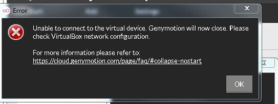
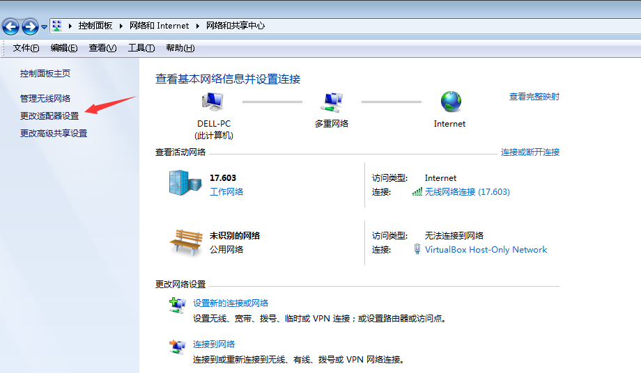
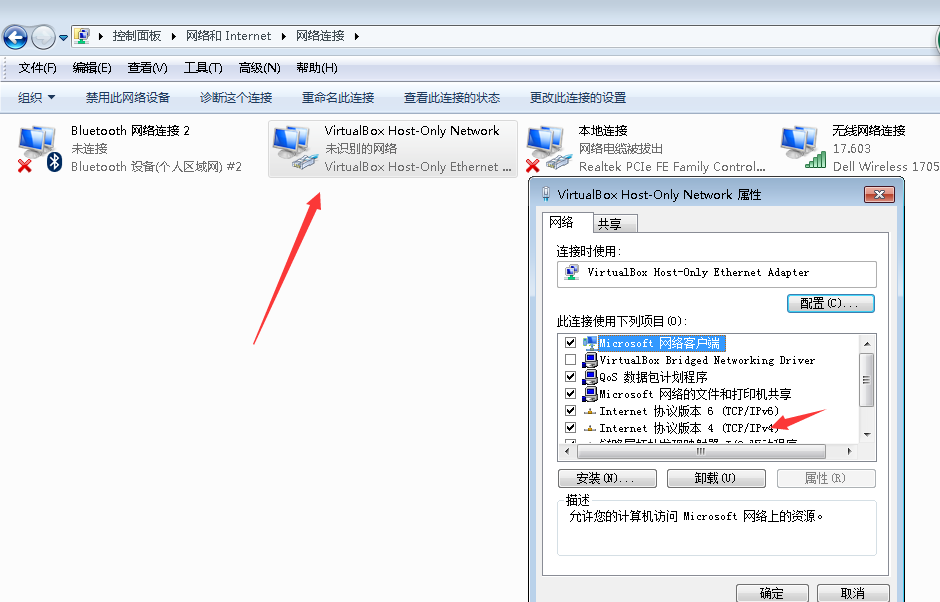
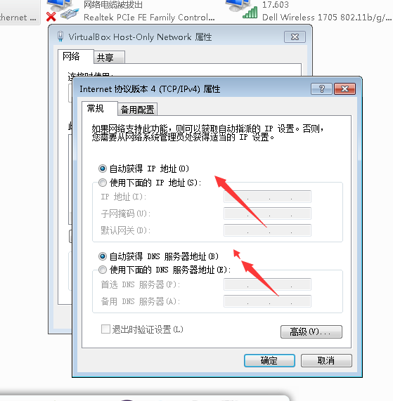
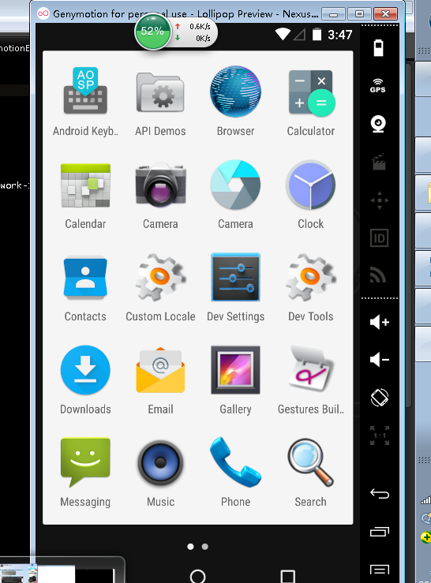

 ### 今天又装了一次genymotion！发现又跪了。（win7）
 >对这个错误简单做一下记录

 第一次下载完genymotion，然后打开，出现黑屏，提示如下：
 
 
 多次重启之后依然发现这个错误存在。原因：网络配置错误引起！
 解决方法如下：
 
 打开控制面板->网络和共享中心->更改适配器设置->virturalBox-HostOnly-Network->属性->InternetIpv4->自动获取即可
 

 

 
 

 
 

 然后重启再打开即可

 