# 第一次gradle成功构建以及编译android stdio 项目

## 生命太短，我用gradle

一直对构建工具嗤之以鼻,之前都是把github上的Project的src跟res，jar包，以及配置文件等一个个复制过来导入ADT即可，但是即使这样也多次碰壁，因为有部分依赖找起来实在蛋疼，而且部分androidstdio项目根本无法转成ADT项目。可以看http://stackoverflow.com/questions/16745793/how-do-you-open-an-android-studio-project-in-eclipse 或者 http://stackoverflow.com/questions/16745793/how-do-you-open-an-android-studio-project-in-eclipse。 于是先前花了两天时间经过一番折腾，终于成功用gradle构建了一个AndroidStdio项目，在这里稍微做一下记录

## 路径配置

### gradle路径配置
-  gradle路径的配置非常简单，下载gradle版本还是挺蛋疼的（墙的缘故）gradle版本传送门：[gradle官网][1]

-  路径：基本就是解压下来的目录，然后在环境变量里面新建一个gradle_home即可。我的gradle路径是：
    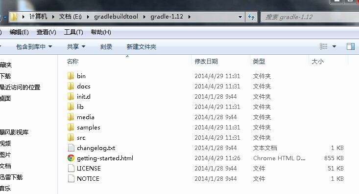
    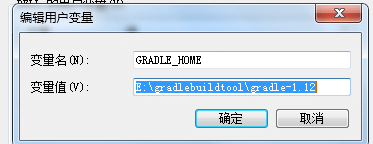
    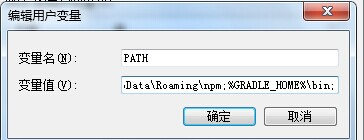
    
- 路径的配置跟java很类似，有问题的童鞋可以去gradle官网自行查看或者google(新知识google，旧知识百度)    

### androidstdio路径配置

- android路径的配置可以查看[这篇文章][2] 
- 但是这篇文章有个坑，妈蛋！

这是我的android_home路径:

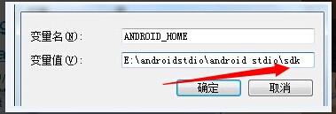

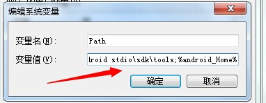

- 坑在第一幅图，对比一下百度经验的图跟我的图就知道坑在哪里了。
-  我摔，差点忘了告诉你们是什么坑，按照百度经验的方法配置路径是找不到extra目录的。于是编译gradle的时候就会显示** could not find any version that matches com.android.support-v4** 之类的错误

## 开始构建

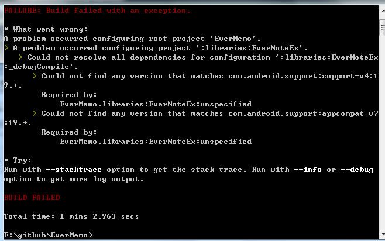

妈的，gradle构建第一次就跪了，至于你要在哪里构建这些就不详细讲了.

把路径修改好之后就可以构建成功.基本上路径没啥问题，扩展的包都下载好OK了。小编作为一名英语渣渣跟菜鸟，去stackoverflow找了好久的答案，说多了都是内啊。

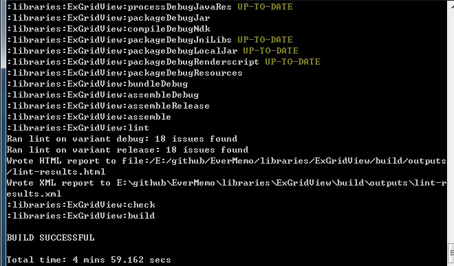

### 还没成功

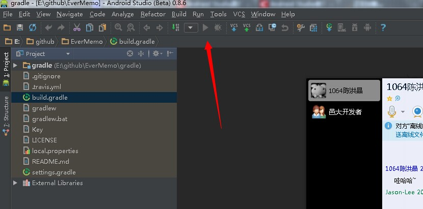

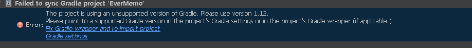

我摔！妈的，构建成功还不给我编译运行，androidstdio的按钮也是灰色的。然后小编又去gradle官网撸了一个1.12版本的gradle重新把路径给配了，才能成功运行。因为原本的我原本的gradle版本是1.8.

当然你会觉得这样也太麻烦了吧。每次构建一个project就要去下载不同的版本来构建，这样也太蛋疼了吧。

- 当然你可以在gradle-wrapper.properties里面修改版本，酱紫的话，同步的时候，gradle就会自己去下载相应的版本，附图：

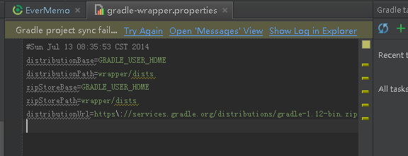

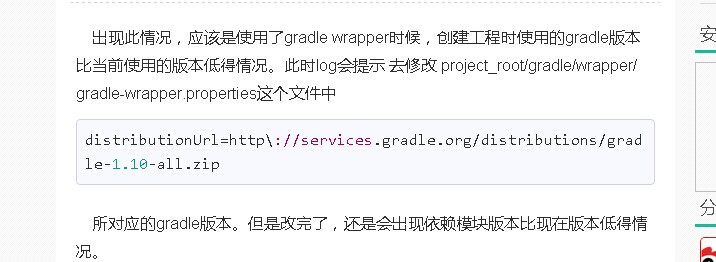

- 又或者你可以修改build.gradle的版本,需要修改的是gradleVersion那一项以及依赖里面的classpath.然后进行同步，但是这个方法有时候同步不鸟，还是不太建议使用。还是附图吧：

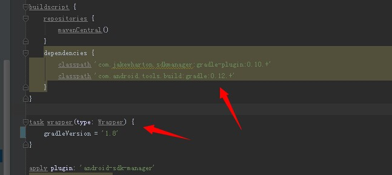

## 成功运行

 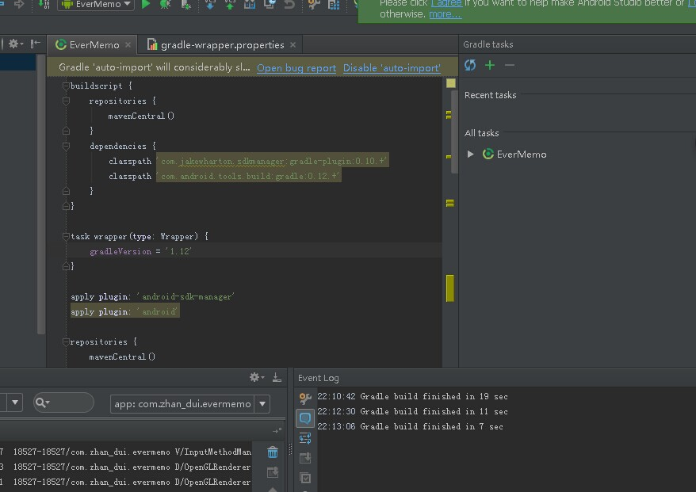

FINISHED 见到了有木有

来一张效果图

有任何问题可以联系我：

[Twitter][3]

email:lizhixiong498056754@gmail.com

[Github][4]

  [1]: http://www.gradle.org
  [2]: http://jingyan.baidu.com/article/17bd8e52f514d985ab2bb800.html
  [3]: https://twitter.com/Jacson_Lee
  [4]: https://github.com/jacsonLee