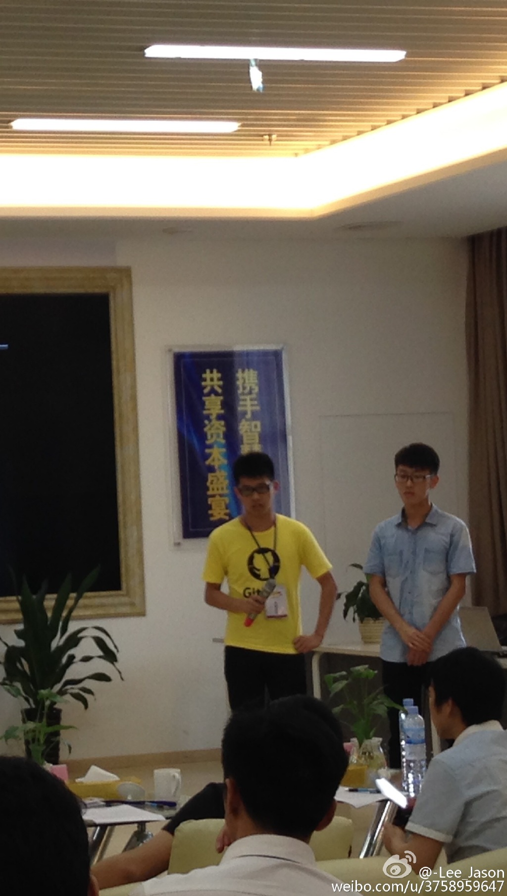

# 焦躁的年龄,焦躁的我
>* 六级放弃治疗,记于2015-6-13

### APP大赛
>* 装逼失败,决定回去好好学习

图片摄于5月30号.早上6点50分的车,带着一路的疲惫还有10W奖金的憧憬,赶到了肇庆的智慧城.本以为这是场学生竞赛,结果到了现场才发现在场的基本都是大企业,大多数来自于广深.与旁边一位稍微年长的大叔聊天,才发现他已经拿了天使轮过两日融A轮,做的是一个创业者资源对接的平台,想法很棒,产品也非常正点.当场看了他的简历:连续11年创业者,曾任中国联通高管,宗申集团总监......(象征性看着天花板惆怅)随后只能是**拿**了好多人的名片,跟很多犀利的CTO,架构师,市场总监汲取了很多宝贵的经验,我都一一牢记下来.我们抽号是13号,下午2点多,大雨滂沱,景恩执意要上台面对观众吹一次牛逼,答辩我再上.面对台下的新浪微博某总监,还有其他几位专家加之台下许多业界精英,景恩也没怯场,表现得真不错,5分钟之内结束战斗.然后我答辩(省略...)答辩完了,华师的一位妹纸找我去见了一下他们的主管,开门见山:我要回学校卖身,加之广州麻烦,合作就算啦.然后灰溜溜地赶着6点钟的车回学校了.再一次发现,以前以为自己可以装逼了,其实也还是傻逼.一直困在象牙之塔,当着井底之蛙,又怎么会懂别人在枪林弹雨中的艰辛,又如何体验在社会机器下的茫然和无奈.

### 焦躁的年龄
>* 噩梦连连

最近我做了好多次噩梦,亲爱的舍友们非常关心我.因为我每次做噩梦自己其实也知觉不深.舍友就会告诉我我常常早起摔枕头或者拍床.事后我才回忆起来:自己确实做了可怕的噩梦,被不知道什么东西追杀.原来自己如此地畏惧死亡,又或者畏惧其他东西,我也不知道.但我确实害怕了.毕业季临近,大四跟我熟识的师兄们很多都是我的良师益友,目测他们都有光明的未来,美满的生活.而大二的我,却变得焦躁不安,我害怕生活的束缚,害怕人生的压力.每次想到自己要暂时待着出租屋,过着月月光的生活,有着一份体面的工作,却无力去对抗无奈的人生,就难以入眠,估计每日的噩梦里缠绕我的是这个吧.梦里不知身是客,两年的流光噼啪闪过.看了一眼手机的倒数日,80天后自己就要成为大三狗.周遭太多人还沉醉于大学的灯红酒绿,每每看到他们真挚的笑脸,我不知作何表情.是该鄙视,鄙视他们的幼稚天真,愚昧不堪,还是该嘲笑自己,强忍多少苦涩,少了多少对影成三人的欢乐,却一味地追名逐利,满身铜臭.焦躁,叛逆或许是我们这类人的代名词!每次或多或少跟朋友们吐槽学院某些垃圾制度,残害学生的生命,浪费学生的时间,特别是我敬重的师兄因为学院的脑残耽误他的实习和另一位大三的因为当了党员现在还必须留在学校之后,我对学院这种饮鸩止渴的方式已经绝望透顶.当然我已经不再是当愤青的年龄了,偶尔愤青一下会让自己保持清醒,知道事情的价值所在,不至于被别人牵着鼻子走.另外,今天干了一件我自己都不敢相信的事情,考六级的时候,考完听力,我竟然根本没法做任何一道接下来的题目,然后10分钟之内把卷子随便填完,交了走人.走出教学楼的那一刻,我竟然感到无比的舒服.因为做题的时候,我无数次在想:把题目做正确了,又有什么用.那就证明你牛逼了,还不如回去玩Duoligo(口语软件)来得实在?就像现在满大街的XXX创业比赛,别人举办个比赛,然后给你个奖,你就牛逼了?那不过是别人给你的荣誉,社会需要的是你的价值,你的能力能带来什么.当然那些可以提升你能力的比赛还是多参加,哪怕是去吹牛逼,起码你学会了吹牛逼,然后回来努力学习一下,就可以争取实现你吹的牛逼.而且吹牛逼也是种能力,有表达力才有说服力.当然牛逼吹多了,分分钟变傻逼.抱着偏激的想法,我最后干了一件这么出格的事情(因为我过了四级,我不担心,别学),当然我现在还觉得很High.换了两年前的自己,估计我也是干不出来的了.哈哈.

### 项目
>* 头都大了

几周前,工作室接了一个大Project.本来打算专心练剑装X的我,被迫无奈卷了进来.老师压下来,想不干都不行.况且执行力不够,你不上谁上.问题是:一开始,队友基本不靠谱,一个人把所有东西担了下来,每一个关口都要把关,想想当时也是累坏了.后来找人分担了一下,舒服多了.但这段短暂的三管齐下的时光,加之脑残地学新东西,学以致用的感觉非常强,简言之:

- 永远考虑什么是正确的
- 尽量跟自我驱动型的人一起干活
- 多看点别的书,很多知识都有用
- 用上所有时间,学各种东西

而更重要的是,在诸多任务种以最快的方式分出优先级次序,逐一击破.常常听身边的人讲:选择比努力重要.但是选择的能力是经过无数努力的积累才得到的.对事情分出优先级次序,有时候更像是一种思考之后得到的技能.准则简介之:

- 如果通过他人讲解可以大大减少学习时间成本(从0开始认知),在不浪费别人生命的前提下,求助于人
- 如果你觉得一件事情很傻逼又必须去做,那就赶快搞定它,别让它浪费你的生命
- 如果觉得一件事情很烦,但是很重要,逼自己立刻去做这件事.
- 了解什么是最重要的.

对于上面用上所有时间,学各种东西这一点需要纠正一下,现在的我自己把朋友圈都关了,远离社交网络,尝试不去与任何人交流,把每一分每一秒都花在学习上,事实却是效率不怎么高.反而有时候觉得自己行尸走肉,跟个机器一样.所以自然就好,不必过度.

### 总结
>* Above of all

废话一大堆,我相信很多人已经把我当傻逼了.我也知道扯淡一点用都没有.能给人自由的不是你所在的位置,而是你所具备的能力,最近WWDC.google刚刚落幕.作为一个脑残果粉+G粉,我虽然不具备change the world的能力,还是想鼓励一下自己:
    
>* write the code.change the world.

    

