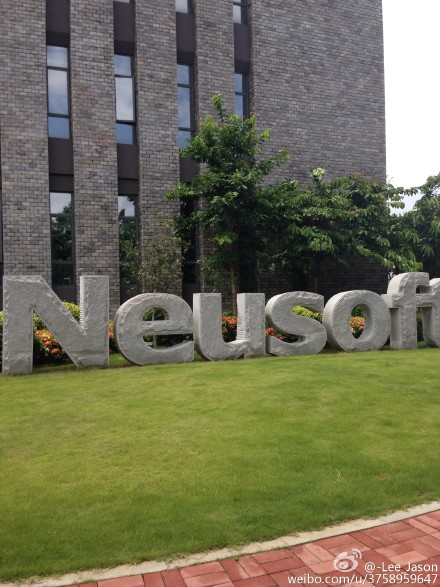
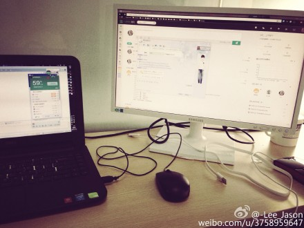

## 口袋香港实习小记
>* 2015-8-23

### 广州萝岗区实训
>* 坑爹的实训

7月4号，本应该是我出发去广州实习的日子，无奈自己犯傻。没第一时间去跟老师申请免修实训，后来再去申请的时候，班导死活不给我走。实训就实训吧，就当是散散心吧。实训安排的就是八天的SSH框架学习+两日的企业参观。给我们培训的是东软睿道。因为先前有php基础的缘故，老师讲的大部分东西我都比较了解，整个过程下来都是蛮轻松的，所以我多出很多空余的时间晚上来学习前端方面的知识以及准备下学期的算法课程！真的说学习到了什么，就是对SSH这种框架跟php做了对比，了解到二者的差异！7月15日下午，检查完实训大作业，实训基本临近尾声，原计划大家晚上出去玩，但是逃心似箭的我很早回去收拾了东西。令我内疚的是，舍友们一边帮我收拾东西，一边说：这十天看到雄哥的时间比两年见到的总和还要多。仔细想来，任性的我一直自顾自地学习，社交，项目，忽略了舍友们的感受，吃东西出去玩，两年来我就参与了两次。但这就是人生！室友一场，选择不同，大多时候你只能离开，用背影告诉他们：不必说。

### 口袋香港实习
>我们的产品：http://dwz.cn/1x2vIA

7月15号晚上我到了广州，超爷老人家好心收留我，实在是感激不尽！第二天正式入职。我在团队做的工作是前端+Android，但刚到公司我只认识frank！frank做的是ios，又在转java后端，是我在一次ios讲座上认识他的！我十分佩服他，在这样的年龄出来创业！特别记得frank在一次吃饭的时候跟我讲：现在不拼一次，再过几年真老了，心态不同了，输不起，上有老下有小.这是男人的担当与责任！工作的第一天，我终于见到了我的老板Iris!相处下来，发现Iris是个非常有魄力的女性，在不缺亲和力的同时，又有明显的执行力，最大的优点是善于听取别人的意见和调剂大家的矛盾！为了庆贺新员工入职，Iris第二天还专门带我们去腐败了一顿，好老板的典范啊（2333）！当然还有另外一个家伙不得不提一下，就是公司的设计师Allen，还记得我刚坐下座位没多久，这家伙就把流程图和设计稿塞给我，然后很仔细地给我讲流程，语速飞快，思路敏捷。除此之外，这家伙还是个有设计洁癖的家伙，经常跟我们争一个透明度或者一个像素。每天的日子基本是这样的：由于我住的是大学城，公司坐落在越秀区！每天早上7点20分，就要起床赶早车，刚开始都是坐地铁，但是每天转车三次实在难受，后来改为搭801公交，一般都能占个好座位，可以幸福地偷睡个几十分钟或者听听Teahour或者听下歌。九点左右到公司开始干活。刚开始的几日，我写的都是android，但是大概是三天之后，我发现他们所有的sharepage的H5页面都没做适配，况且那些样式也确实有点问题。公司又没有前端，然后我就上了，在米萨卡大神的指导下，把所有的页面都重新做了适配，顺便把预约的部分也搞定了。给自己打个分的话，也就60分！毕竟在这块，经验确实不够，都是现炒现卖，但是也算中规中矩！晚上下班的话都是六点，每晚都是Allen陪我一起下班，大家一起去天河搭车！Allen真是个非常excellent的人，不仅仅是能力方面，对各种事情的看法也非常独到，还十分有个性，而且眼界非常开阔，很有想法，所以一路上的交流一直都获益良多。然而出来工作是非常辛苦的，因为过度的劳累，很容易就被生活磨平菱角，变得为了工作而工作，上班为了等下班，所以要经常给自己一点力量。仔细想想，拿着份薪水，每天靠着吃老本，做着同样的工作，持续到30多岁，靠着搞办公室政治跟手段升职加薪，不应该成为我们这代人追求的东西，起码不是我追求的东西。

### 总结
>* 莫问前程，但行好事

- 做喜欢的工作很重要，如果你的工作不是真爱，晚上下班回来还真是没有动力继续学习新的东西。
- 现在的年轻人有能力做好60分的事情，却总想着做80分的事情，结果就是最后只做了2分3分的水平！摆正心态很重要！
- 学会跟同事相处，永远考虑最有价值的事情。

