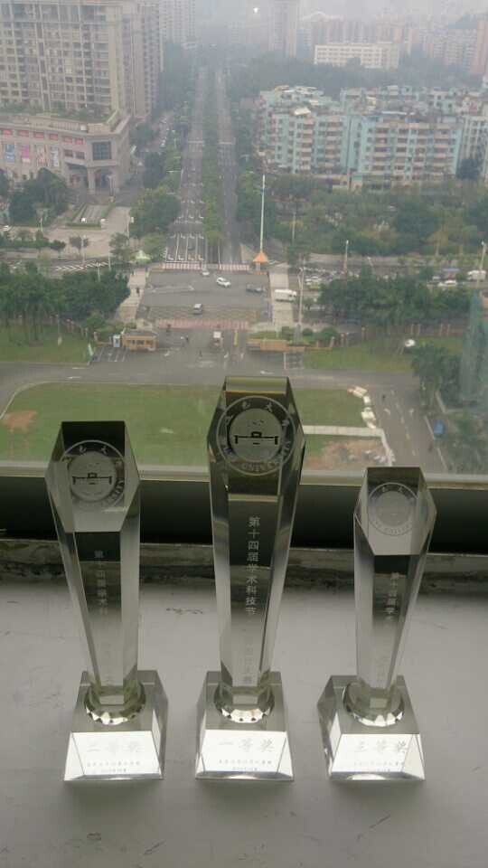

# 这段时间
>* 有点倦,想缓一缓

## 序
>* 好久没写blog而且一直忙，没时间静下心来写东西

好久没写博客了，记得上次写关于生活的博客，还是在暑假。

    
不知不觉，截止到今日为止，已经连续58天提交代码。虽然有刷贡献的嫌疑，但是大部分都是实实在在的提交.期末也近了，20号又要忙着四级，而海哥想让我们帮他做个约运动的app.我心里也觉得这种社区应用很飘，前段时间拿了几千万融资的一个社区应用死掉之后我更加坚定了自己的看法.To be honest,开学折腾到现在，身心疲惫！
    

## 东莞项目
>* 谢谢英爷

暑假的时候，大概8月5日，回家了十天，见了要见的各个朋友，陪父母几天，也就这样了。然后8月底，柱哥找了英爷做项目。因为缺人手，英爷拉了我这个半桶水进去。东莞的项目就这样揭开序幕，虽然到目前为止，也就只是完成了第一期。谈了一个月的需求，结果就是在国庆七天之内出个app原型。北主楼居然被封锁了，最后战场锁定在宿舍。每晚熬到三点多，第八天的时候，终于弄出了一个很粗糙的原型，幸运的是老师也收货。然而后台庞大，英爷也是第一次使用thinkphp，一期的交付基本是一拖再拖，也实在是难为英爷。当时我只恨自己不会写后台，帮不上忙。也只能是抓紧时间对app进行修修补补。老师去广州演示的前夕，我居然还手贱传错了安装包，最后只能早上7点过来把问题解决。还好都过去了。
    
### 问题
代码存在各种问题：英爷在[这里][1]狠狠刮了我一个耳光。有错就改吧，也不是什么大不了的事情，年轻输得起。最怕的不是有人打脸，而是有人给你指出错误，你还不客观的去思考，还自以为是。在大学，有人给你指出错误，是幸运的。因为还有人给你纠错！出去工作呢，错了就错了，只能自己找，稍微不注意，丢掉工作也是正常。
    
    
## 软件大赛
> we make again

 整个暑假下来，我也做了个东西。折腾得辛苦，到网上不断的捣腾，到现在还不不是特别懂贝塞尔曲线的运用以及文字编码的各种转换，但还是捣腾出一个粗糙的东西。

    
这个只支持离线阅读,而且导入还只能手动，自动都没做。原本还想抓一些数据，弄个在线书城，一直没时间！软件大赛的时候也是报了名，最后的结果却是为了赶轻会议，这个却顾不上了。虽然花了很多时间捣腾，但是我对它也不抱什么希望。一：这个东西不完善(功能不全).二：无市场，更无推广价值，纯粹比赛完就丢掉。三：轻会议重要很多.->1:英爷跟baby炼快要离开了，能跟他们一起做一个作品，真是说不出的开心。2:很想保住三连冠。
    
### 轻会议

    
4号左右的时候，简单讨论一下，就开始做轻会议了。做着做着，发现自己各种基础不扎实，各种不熟悉。11-28晚上就要交付了，又遭遇了一些简单的问题，我却用极度复杂的方式来思考。最后还是在英爷帮助下解决了。很多时候并不是自己不会，而是时间紧急了，人就慌了，越慌乱就越容易出错，这确实是我的硬伤。

12-7：we make it again

## 师兄毕业
>* 大一就能遇见你们，真好。

剑伯，昌爷，亮爷，块导都毕业了。大一进来仿佛还在昨日。那是大一国庆，我第一次见到剑伟，给我第一感觉就是好强壮，然后人很和善。相处这么久，没见过他发过一次火，虽然有时候觉得剑伯好像还有另外一个世界，但是他总是与人分享他的各种想法，即使是我这个师弟。亮爷老实随和，带着极客精神，每次遇到他，总会有很多话想跟他讨论。原本以为他是那种老实到跟女生聊天都会脸红的家伙，现在他回来大学寻找真爱，还真让我大吃一惊，祝福他！昌爷就是一逗比！如果我们同届，一定会经常在一起玩，他是我见过的最适合当伙伴的人。每次有好玩的事情，我都会跟昌爷分享，到现在我自己也不知道为什么...至于块导，记得第一次面试我的人就是他，面试的时候以为他是个正经得不行的人，结果相处下来，发现就是一个神经病，比我还神经！但是他确实是个做人做事都认真的人，对待他人很真诚！我不是拍马屁，这些都是老实话！大一就能遇见你们，真好！

##一些纷争

英爷跟baby炼峣总前几天被计算机某书记发飙了一顿，就因为软设的冠军指导老师填的是经管老师的名字。原本作为老师，看到自己的学生有所成就，应该高兴才对，而计算机学院的老师却只看重自己的荣誉，孵化中心这么急功近利，我也是呵呵了！昨晚喝酒，王老师一次又一次问他们几个走还是留？杰英也是知道孵化那边制度不行，很果断地说留.估计如果真的在那边的话，可能我们都被卖了！其实我也是喜欢这里！因为有家的感觉，还有高中的感觉！希望这些纷争就不要再延续到我们这里了。

## 懒散了
>* 大二

大一的时候，每晚11点半，我就早早躺下床，只是为了第二天早点过去陆佑图书馆开门，早点学习.有种抓住最后一根救命稻草的味道，因为高考考烂了，人生已经没得选择了，事实上就算到了现在，也是没得选择!那个时候就像有股力量把你埋进水里，而你拼命挣扎，只为呼吸一下新鲜空气。现在，大二了，逃了很多课，有用的，无用的，学会了的，没学过的，想逃就逃！每天晚上，回去了躺下，打开手机，一玩就玩到1点多，然后第二天睡得一塌糊涂。针对逃课，原本逃掉无用或者已经熟悉的课程，把时间花在重要的事情上，这个一点问题都没。但是我现在已经是逃课成瘾！晚睡也是要好好反省！

##爱情看法
>* 对你们两个的追问作出解释.

前段时间，每晚吃夜宵，英爷炼哥老是催我上师妹。确实有个师妹送上门，还请我吃麻辣烫，但是我估计她是开玩笑的吧。果然后来还是被一个大三的师兄上了。但是他们两个还是一次又一次地在我面前提起。我摔！我并不是弯的好吗。我只是不想随随便便。别人都说大学里面的爱情是拿来练手，我虽然没有遇到，就算遇到，我也不想只是练手。如果真是练手，这是对别人不负责任，也是对自己不负责任。而且上了大学，人都变得浮躁了，我都不知道每个女生到底是怎样的。仔细想过：真心在一起的两个人，不应该是整天黏在一起，应该认真考虑对方的现在还有未来，所以我现在认真努力学习，原因之一也是为了将来的她.如果你连幸福都给不了别人，还有什么资格去爱人家。看到英爷接二连三，我也是醉了。但我不知道怎么说他，也许是他比较享受生活吧！
    
## 对创业的想法

前几周，昌爷回来交报告，我们师兄弟几个约了柱哥一起吃饭（其实是两个师兄请的老师）！那顿饭，谈了好多，谈到考研，工作，女友，从老师的小学谈到博士...还有创业。当时柱哥问，我们几个有没有打算一起开公司？我只是小声说：当然想！至于为何想开公司：

- 最能拼的年龄，不想拿来装饰别人的梦
- 就算很牛，在大公司里面当一辈子的工程师，又有谁记得你
- 不是为了追名逐利，只是不想让庞大的社会机器控制我的命运
- 只为遇见我的英雄，一起开天辟地
    
或许

- 选择稳定的生活，不去冒险，好好照顾家人，得到自己想要的，也挺幸福！

加油吧！
    
    

  [1]: https://github.com/Jayin/jayin.github.io/issues/41