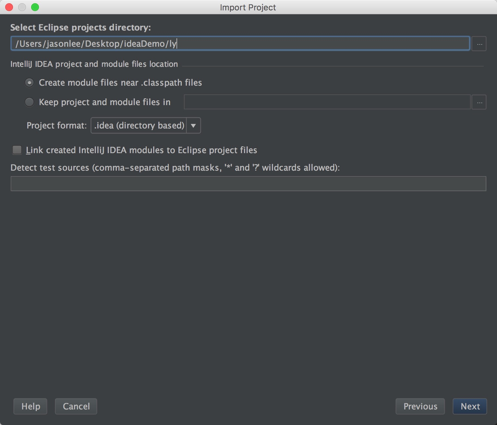
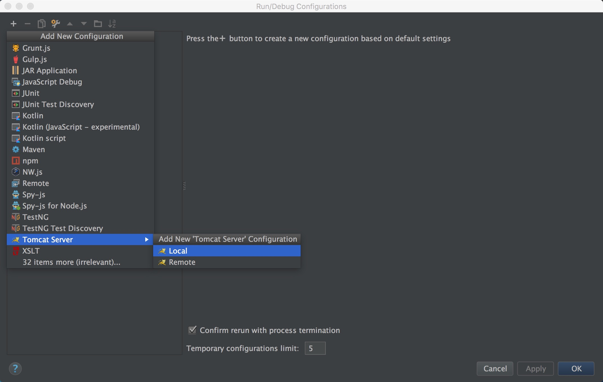

## 迁移你的eclipse项目到IntellJIDEA
>* 讲诉如何迁移你的myeclipse项目到IntellJIDEA

图片居多,跟着图来做即可

### step1.

 打开IJ,选择导入你的eclipse项目,跟着下面三幅图操作吧！

 

 
 
 
 
### step2.

导入之后 肯定报一大堆错误,其实只要重新调整一下项目的结构即可

1. project那个项 基本不需要看 大概知道每个啥意思就可以了2. 
2. 选择module模块,点击+号,把项目加载进来，注意选择成web工程！
3. 点击你的项目,添加一个ApplicationServerlibrary,因为后面要使用tomcat,所以要在这里加入对应的library
4. 加入tomcat之后呢,点击web,选择成为web工程之后,肯定要配置一下对应的东西不是?

5. 右上部分选择的是web.xml的配置文件的路径
6. 右下部分选的是的webContent的目录

### step3

把工程目录建立好之后,下一步就是引jar了,点+号你的项目对应的放jar的目录即可

### step4

接下来建立一个Facets

基本上跟module的web部分的配置一样
右上是web.xml,右下是WebContent的目录,配置好这两步的时候右下角会有警告,就是要我们去弄Artifacts

 
 
 
### step5
 
 
 artifacets翻译过来是工件,个人愚见,应该是指工程里面某个阶段的产物!在这里！讲的那么高大上,其实就是要你配置一下打包输出的目录即可
 
 
 
 
 
 
### step6

接下来是tomcat的配置,看图应该都懂的了,最后点击三角形跑起来

恭喜恭喜

结语:
   时间仓促,写的不好,有任何问题都可以联系我!
   
   
[微博][3]

email:lizhixiong498056754@gmail.com

[Github][4]

  [3]: http://weibo.com/3758959647/profile?rightmod=1&wvr=6&mod=personinfo
  [4]: https://github.com/jacsonLee
