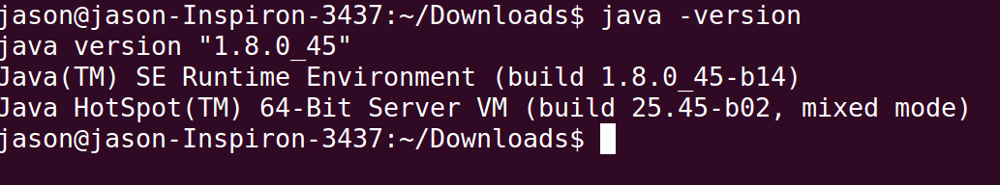

# Ubantu下安装JDK
>* 我的Ubantu是14.04,jdk版本1.8

为了愉快地玩idea,决定在linux下装phpstorm跟webstorm.结果两个都要求装java环境.师兄们建议安装sunjdk,弄了一下搞定了,做下记录

## 第一步:下载
地址:http://www.oracle.com/technetwork/java/javase/downloads/jdk7-downloads-1880260.html

然后选择同意Licese,下载tar.gz压缩包

## 第二步:解压

解压tar.gz包都是用tar zxvf命令(进入到当前目录)

```
sudo tar zxvf ./jdk-8u45-linux-x64.tar.gz
```

### 第三步:设置环境变量
设置环境变量需要使用.bashrc这个文件
cd ~ 进入到根目录,ls -a 即可查看到.bashrc这个隐藏目录

注:修改.bashrc之前最好先备份一下
```
cp .bashrc .bash_original
```

然后使用vi或者vim编辑.bashrc文件

```
vim ~/.bashrc
```

在该文件的末尾添加以下代码

```
export JAVA_HOME=/home/jason/DOwnloads/jdk 
export CLASSPATH=${JAVA_HOME}/lib:.
export PATH=${JAVA_HOME}/bin:$PATH
```
- JAVA_HOME存放的是jdk的安装目录.
- 设置CLASSPATH时候,加上当前目录(.)
- 设置PATH的时候,export PATH=${JAVA_HOME}/bin:$PATH,$PATH前的连接符号是冒号(:).win下是分号(;)

为了让修改立刻生效,在终端执行以下命令:
```
source ~/.bashrc
```

## 第四步:验证

在终端输入

```
 java -version
```
看到类似下图,说明你成功了.



