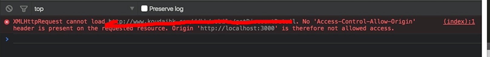
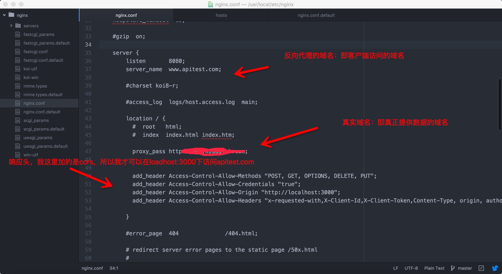
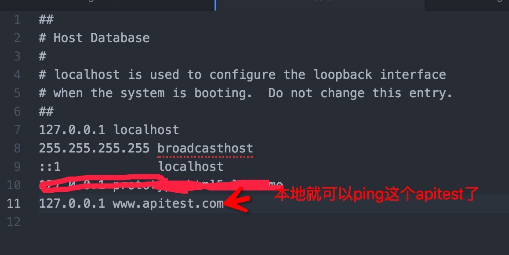
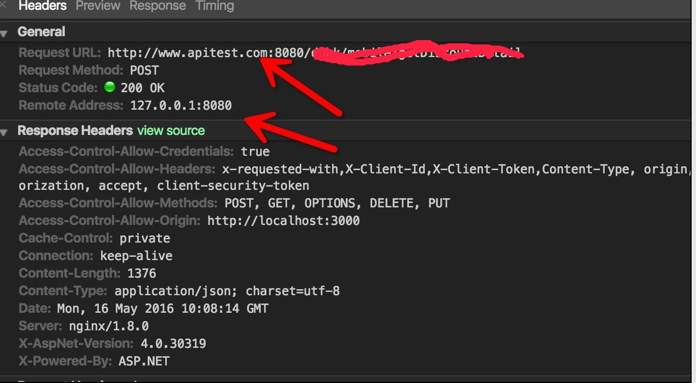

# nginx反向代理

## 起因

 今天遇到个问题:因为业务上的一些需求,我需要使用旧的asp的接口.请求旧接口的时候,有点悲剧，服务端没有做cors,也没采取jwt的方案。只能用代理把请求转发出去,才能拿到数据了
 

## 正向代理和反向代理的区别
>* 回来的路上,一个朋友问我正向代理和反向代理的区别,结果讲不出来

正向代理:

正向代理就是平时说的代理,比如我要访问一个网站,那个网站不给我访问,但是代理服务器可以访问,我就叫代理服务器去访问那个网站,然后拿到我想要的东西。说那么多,其实就是个跳板,用过翻墙软件的人 基本可以秒懂 !

反向代理:

客户端访问一个服务器A要数据包M,事实上服务器A没有数据包M,但是服务器B有数据包M,然后服务器A去服务器B那里拿数据包M,然后再返回给客户端。这里就可以说 服务器A设置了反向代理。对于客户端来说,服务器A就是提供原始服务的服务器。

两者听起来好像没啥区别,区别就在于:1.正向代理,客户端需要设置一些东西,反向代理,客户端没啥好做的！2.正向代理的典型用途是为在防火墙内的局域网客户端提供访问Internet的途径。正向代理还可以使用缓冲特性减少网络使用率。(典型例子:通过vpn访问google)。反向代理的典型用途是将 防火墙后面的服务器提供给Internet用户访问。反向代理还可以为后端的多台服务器提供负载平衡，或为后端较慢的服务器提供缓冲服务。（典型例子:第三方的可以访问google的网站）3.正向代理允许客户端通过它访问任意网站并且隐藏客户端自身，因此你必须采取安全措施以确保仅为经过授权的客户端提供服务。
反向代理对外都是透明的，访问者并不知道自己访问的是一个代理。

## nginx设置

 nginx安装 就不多说了 网上一大把
 首先需要科普一下 nginx配置文件里面的东西 看这篇文章
 
 https://segmentfault.com/a/1190000002797601
 
 
 我这里直入操作
 
 第一步：
 编辑nginx的配置文件,我这里采用的是atom来进行编辑,当然因为vim比较蛋疼 我比较懒的缘故,基本上把proxy_pass跟主机名还有响应头设置好就可以了
 
 
 
 第二步：
 编辑host文件
 
 
 
 
 这样的话 访问流程就是
 
  localhost:3000 -> request -> (proxy: apitest.com) -> proxypass -> (dist: www.xxxx.com) 
  
  
  第三步：
  客户端写个ajax去试验一下
  
  
  
  200成功拿到数据！这样就不用搞cors或者jwt了,服务端在同域的设置下,你也可以这样子来做开发,最后改下主机名,然后把代码扔进去就可以了。
  
  
  写的不好,有任何问题可以联系我。欢迎打脸,多学习交流！
  
  
  
  
  
  
 
 
 
 
 
 
 

