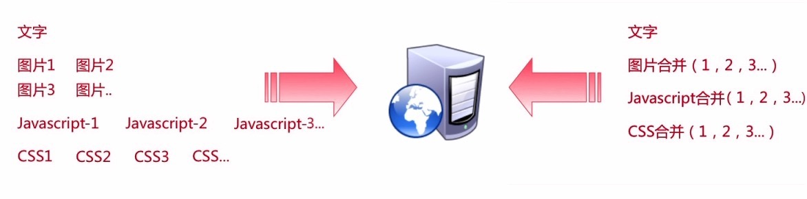
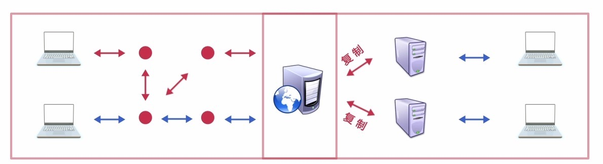
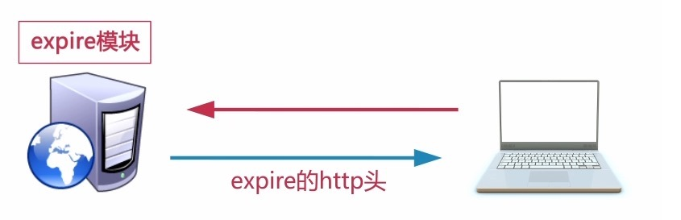
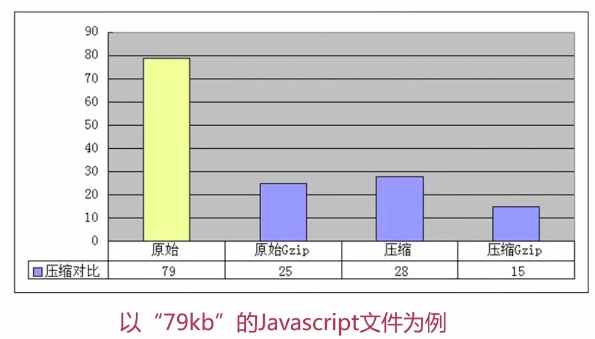
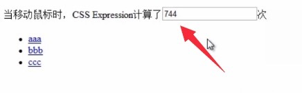
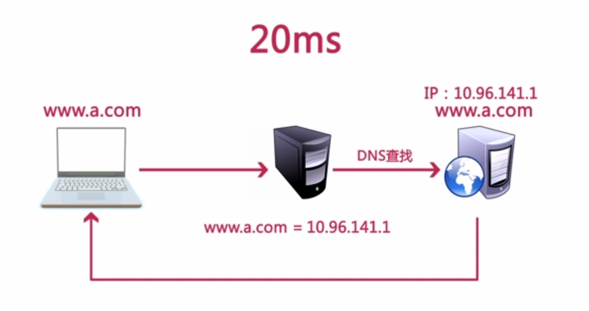
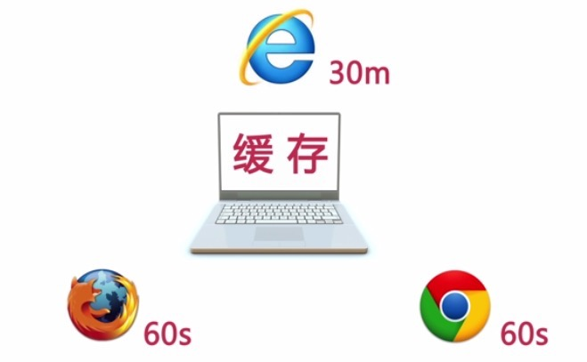
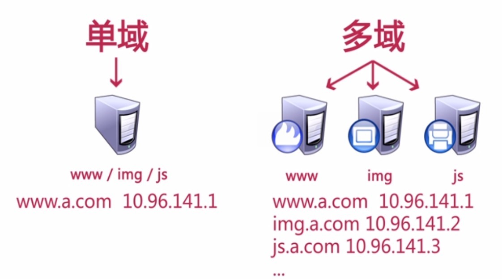
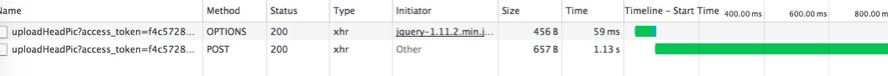

## web前端页面速度优化的多条建议
Web性能优化这个词既可以解读成页面加载速度（Page Speed）的优化，也可以解读成页面渲染性能（Page Performance）的优化。或者是二者的集合。


### 1.合并静态资源,进来减少HTTP请求个数
包括CSS、JavaScript和小图片，减少HTTP请求.但是又要合适考虑合并之后的文件体积,具体合并与否需要看场景



### 2.使用CDN
或者一些公共库使用第三方提供的静态资源地址(比如Jquery,normalize.css).一方面增加并发下载量,另一方面能够和其他网站共享缓存.



### 3.添加Expire/Cache-Control头
Expire:expire的内容是一个时间值,值就是资源在本地的过期时间,存在本地,在本地缓存阶段,找到一个对应的资源值.如果当前时间还没有超过资源的过期时间,就直接使用哪个这一本地资源,不会发送http请求.
Cache-Control:顾名思义，这个是负责页面缓存机制的头,如果该头部指示缓存,缓存的内容也会存在本地.但相比Expire,Cache-Control有更多的选项,也有更多的处理方式




### 4.开启服务器端的Gzip压缩
这对文本资源非常有效,对图片资源则没有那么大的压缩比例.



### 5.把CSS放到页面头部,把Javascript放在页面底部
因为浏览器先解析html+css,把结构给显示出来,如果先执行javascript脚本,则会阻塞页面渲染,让页面出现长时间的空白

### 6.避免在CSS中使用Expressions
简单举个CSS表达式的例子:

```
<html>
<script type="text/javascript">
	var i = 0;
	function scare(){
		i++;
		document.getElementById('run').value = i;
		return;
	}
</script>
<style type="text/css">
ul a {witdh:expression(this.offsetWidth > 750 ? scare() : scare());}
</style>
<body>
当鼠标移动时,cssExpression计算了<input id="run">次
<ul>
  <li><a href="http://www.baidu.com">aaa</li>
  <li><a href="http://www.baidu.com">bbb</li>
  <li><a href="http://www.baidu.com">ccc</li>
</ul>
</body>
<html>
```


### 7.避免空的src和href
留意具有这两个属性的标签如link，script，img，iframe等；src被javascript动态赋值的时候,会发多一个http请求,href标签也是同理。

### 8.将CSS和JS放到外部文件
如果部分css跟js只在一个页面出现,则可以考虑css内联。重用的css跟javascript则单独放置于外部.

### 9.减少DNS查询
当你输入www.baidu.com到你的浏览器时，一个连接到你的浏览器的DNS解析器返回该服务器的IP地址.DNS查询是有代价的。通常，需要20-120毫秒查找特定主机名的IP地址。在DNS查询完成前，浏览器无法从该主机下载任何东西。为了更好的性能表现，DNS查询是被缓存的。在一个特殊的缓存服务器上可以缓存这些信息，它由用户的ISP或局域网设备维护，同时用户的计算机也由缓存。DNS信息仍保留在操作系统的DNS缓存中（。大多数浏览器都有自己的缓存，它们独立于操作系统的缓存。只要浏览器在自己的缓存中有了DNS记录，它不会为每个请求都访问操作系统中的记录.当客户端的DNS缓存是空的（包括浏览器和操作系统），DNS查询数目等于网页中独立的主机名数量。这包括在网页的网址，图片，脚本，样式，Flash等等的URL中。减少独立的主机名数量就减少了DNS查询次数.减少了独特的主机名有可能减少该网页中并行下载的能力。避免DNS查询减少了响应时间，但是减少并行下载能力可能会增加响应时间。我的准则就是这些组件至少两个主机名，但不超过4个。这样做就可以很好的折衷减少DNS查询，并有高度的并行下载能力.

浏览器缓存时间

缓存时间长：减少DNS重复查找,节省时间
缓存时间短：及时检测服务器的变化,保证正确性

所以可以根据网站性质的不同 做不同的处理,确定用几个域名来处理自己的网站是最合适的



### 10.压缩源码和图片

JavaScript文件源代码可以采用混淆压缩的方式，CSS文件源代码进行普通压缩，JPG图片可以根据具体质量来压缩为50%到70%，PNG可以使用一些开源压缩软件来压缩，比如24色变成8色、去掉一些PNG格式信息等.可以考虑压缩工具JSMin和YUICompressor

### 11.避免跳转,重定向
重定向一般使用301或302状态码完成.来看一个http头中的301响应的重定向：
HTTP/1.1 301 Moved Permanently
Location: http://example.com/newuri
Content-Type: text/html
浏览器会自动将用户重定向到Location字段中指定的网址。所有必要的信息都在头信息中。响应体通常是空的。301、302响应是在实际中是不缓存的，除非特地用Expires或Cache-Control表明。HTML的Meta Refresh标签或用JavaScript也可以将用户定向到不同的网址，但如果你必须做重定向，首选的方法是使用标准的3xx HTTP状态码，主要是为了确保浏览器后退按钮的正常工作.
其中最浪费的重定向频繁地发生和Web开发人员通常都不知道这件事。它发生在结尾缺少斜线“/”的URL，结尾应该有“/”。例如，要访问http://astrology.yahoo.com/astrology，结果一个301响应重定向到了http://astrology.yahoo.com/astrology/（注意“/”）。
如果你使用的是Apache，在其中使用Alias或mod_rewrite或DirectorySlash指令修复了这个问题。如果两个代码路径托管在同一台服务器上，替代方式是使用Alias和mod_rewrite。如果一个域名变化的原因需要使用重定向，替代方式是创建CNAME（一个DNS记录，创造了一个指向另一个网域名称的别名），结合使用Alias或mod_rewrite 。

### 12.剔除重复的JS和css
重复调用脚本,一方面增加额外的http请求,另一方面还会造成多次运算.IE和Firefox不管脚本是否缓存,都会重复计算javascript.

### 13.配置ETags

Entity tags(ETags)(实体标签)是web服务器和浏览器用于判断浏览器缓存中的内容和服务器中的原始内容是否匹配的一种机制("实体"就是所说的"内容",包括图片,脚本,样式等),是比last-modified date更灵活的机制,单位时间内文件被修过多次,ETag可以综合Inode(文件的索引节点(inode)数),MTime(修改时间)和Size来精准进行判断,避免UNIX记录MTime只能精确到秒的问题.服务器集群是使用,可取后两个参数。使用ETags减少web应用带宽和负载.
例如:
HTTP/1.1 200 OK 
Last-Modified: Tue, 12 Dec 2006 03:03:59 GMT 
ETag: "10c24bc-4ab-457e1c1f" 
Content-Length: 12195

如果浏览器要验证该组件,它就使用If-None-Match头把接收到得ETag信息发送回原始服务器.如果ETag匹配上了,服务器就直接返回304状态码以节省开销,例如:
GET /i/yahoo.gif HTTP/1.1 
Host: us.yimg.com 
If-Modified-Since: Tue, 12 Dec 2006 03:03:59 GMT 
If-None-Match: "10c24bc-4ab-457e1c1f" 

HTTP/1.1 304 Not Modified


### 14.选择合适的图片格式
如果图片颜色数较多就使用JPG格式，如果图片颜色数较少就使用PNG格式，如果能够通过服务器端判断浏览器支持WebP，那么就使用WebP格式和SVG格式.

### 15.使用AJAX可缓存
利用时间戳,更精巧的实现响应可缓存与服务器数据同步更新


### 16.使用GET来完成AJAX请求
当使用XMLHttpRequest时,浏览器中的POST方法是一个“两步走”的过程:首先发送文件头,然后才发送数据.在url小于2K时使用GET获取数据。


### 17.组件延迟加载
哪些是渲染这个页面必需的。剩下的内容都可以等到后来加载.
JavaScript可以非常理想地根据需要切分成onload事件之前部分和之后部分。例如：你有JavaScript代码和库来实现拖拽和动画功能，这些都能后加载，因为拖拽是在页面初始化渲染之后。其他如隐藏的内容（用户动作触发才显示）和展开折叠才显示的图片等
ex:YUI Image Loader让你能延时加载折叠下面的图片,YUIGet能在运行时加载JS和CSS文件,用firebug的网络面板查看Yahoo！Yahoo的首页加载过程,就是一个很好的例子


### 18.组件预加载
预加载（preload）看上去和后加载（post-load）相反，但是实际上它们的目的完全不同。预加载组件是浏览器空闲时请求组件（例如：图片，样式和脚本），这些资源你可能在未来会用到。用这种方法，当你访问下一个页面时会发现需要的大部分资源已经在浏览器的cache里面了，页面的加载速度就会很快。
预加载的几种方式:
1.无条件预加载
ex:google.com是在onload事件里面预加载一个sprite图片.sprite图片在google.com首页中没有用到,但是在后面的搜索结果中就用到了

2.条件预加载
基于用户动作,做出推测,预测用户下一个要去的页面,进行相应的预加载.在search.yahoo.com你能看到当你开始在输入框中输入时一些预加载额外资源的请求.

3.预测预加载
通常在改版前进行的预加载。ex:新站点很酷,但是比以前慢了。部分原因可能是用户访问你老站点时带着cache,而访问你的新站点时,cache是空的.你可以在改版上线前用该方法减少这种负面的影响:老站点页面在浏览器空闲时加载一些在新站点会用到的资源文件

### 19.减少DOM访问
用javascript访问DOM元素非常慢,为了有一个相应更快的页面,你应该:

- 把访问过的元素对象做cache
- 以"离线"方式更新节点,然后添加到DOM树里
- 避免使用Javascript来fix布局问题

### 20.根据域名划分页面内容
拆分组件分布的域名可以增加并行加载能力。但是,务必不要多于4个域名,那样会带来更多的DNS查询而浪费资源的后果.ex:你的html和你的动态内容在www.example.org上,将静态的组件拆分到static1.example.org和static2.example.org上

### 21.尽量减少iframe的个数
iframe允许在父文档里面插入一个html文档。
iframe优点

- 对速度比较慢得第三方内容有帮助.比如:广告,徽章
- 安全沙箱
- 内外脚本并行下载

iframe缺点

- 即使iframe是空的,消耗的资源也是比较多的
- 阻塞了页面的onload事件
- 非语义化


### 22.避免404
HTTP请求时间消耗是很大的，有些站点把404错误响应页面改为“你是不是要找***”，这虽然改进了用户体验但是同样也会浪费服务器资源（如数据库等）。最糟糕的情况是指向外部 JavaScript的链接出现问题并返回404代码。首先，这种加载会破坏并行加载；其次浏览器会把试图在返回的404响应内容中找到可能有用的部分当作JavaScript代码来执行。


### 23.减少Cookie的大小
因为很多理由需要使用cookie，例如：认证，个性化等。cookie在HTTP头信息，是服务器和浏览器之间的信息交互。为了最大程度地降低对用户响应时间的影响，需要让cookie的大小尽量最小化。

总结:

- 取消没有必要的cookie
- cookie尽量小,对响应时间影响尽量少
- 设置cookie时要设置到合适的子域下,这样才不影响其他子域
- 设置合理的过期时间。让cookie早点过去或者不设置时间(session cookie)可以改善响应时间 


### 24.使用无cookie的域
浏览器请求一个静态的图片时也会发送cookie数据，然而服务器可能根本就不用这些cookie，那它们只会浪费网络带宽，没有理由被发送。务必将静态的组件放在cookie-free的域名下面。你可以创建一个子域名来放置你所有的静态组件.

如果你的web域名时www.example.org，你的静态组件可以域名是static.example.org。尽管如此，如果你在顶级域名example.org上而不是在www.example.org上设置了cookie的话，在请求static.example.org上的静态组件时cookie仍然会被发送过去。针对上面的例子，你应该重新买个（顶级）域名。Yahoo！使用yimg.com，YouTube使用ytimg.com，Amazon使用images-amazon.com等等。

使用cookie-free的域名还有一个好处：有些代理服务器会拒绝为有cookie数据提交的请求使用cache技术，cookie-free就可以使用cache。


### 25.减少DOM元素个数

使用更适合或者在语意是更贴切的标签，要考虑大量DOM元素中循环的性能开销。

### 26.开发智能事件处理程序
有时候感觉页面对动作的响应比较慢，很有可能是因为在DOM树不同的元素上添加的事件处理太多了，它们被执行的太频繁了。这样的情况下用事件代表团的方式出来比较好。例如：有10个按钮在一个div中，只需要给div上添加一个事件处理函数，包装一下避免给10个按钮都加上事件处理函数了。事件冒泡上来，处理函数捕获到，并能分析出来源自哪个按钮，做相应的处理。

如果你想操作DOM树也没有必要等到onload事件来触发，通常你只需要等到该元素在DOM树中可以被访问就行。没有必要等到所有的图片都加载进来。DOMContentLoaded事件可以考虑来替代onload事件，但是它不是所有浏览器都兼容的，所以你可以用YUI的Event实现的onAvailable事件。


### 27.用<link>代替@import
根据前面的规则CSS文件应该放在页首来改善页面渲染。在IE中@import的行为和在页尾使用来加载效果一样，所以最好不要用@import了。

### 28.避免使用滤镜
IE特有的AlphaImageLoader滤镜是为了解决在IE7以下正彩色PNG图片的半透明的bug。用了此滤镜会阻塞渲染，直到浏览器下载那张图片为止。这个滤镜是应用在单个元素上的，而不是单张图片上的，所以内存消耗成倍增加。
最好完全不使用AlphaImageLoader滤镜，用精细加工过的PNG8代替，在IE也能用。如果你真的需要，请使用_filter来hack吧，不要影响IE7及以上的用户。


### 29.优化图片

网页设计图出来以后，FTP传到服务器之前，仍然有些可以优化的地方。

检查GIF图片的色彩数，看是否用了调色板。用ImageMagick很方便检查：identify -verbose image.gif。当你看到了图片正在使用调色板里4色和256色时，就说明还有优化的空间。

试着将GIF转成PNG，看看有没有节省的空间。往往是没有。开发者经常犹豫是否使用PNG是因为浏览器的支持不够，但现在这些已成为历史。唯一正真的问题是真彩色PNG的alpha透明滤镜，但相比GIF也不是真彩色，不支持变化的透明。所以GIF能做到的PNG8都能做到（除了动画）。一个简单的ImageMagick命令转成安全的PNG：convert image.gif image.png。故，我们经常说：“给PNG一个机会。”

使用PNG的优化工具：pngcrush。例如：pngcrush image.png -rem alla -reduce -brute result.png。

使用JPEG的优化工具：jpegtran。这个工具对JPEG操作损耗很小，例如：旋转，优化，删除注释和其他没用的信息（EXIF信息）。命令：jpegtran -copy none -optimize -perfect src.jpg dest.jpg。

### 30.优化CSS Spirite

水平罗列小图片比垂直方式罗列最终生成的图片要小。
合并相似的颜色让你的色彩数尽量少，理想情况256色以下，适合PNG8。
对无线设备“友好”，小图之间的间隔不要太大。这样对图片大小没什么影响，但用户代理把图片转成像素点阵时来说可以节省一些内存：100x100时是10K像素点，当1000x1000时是1M像素点。

### 31.不要在HTML中缩放图像——须权衡
不要为了在HTML中设置长宽而使用比实际需要大的图片。如果你需要：


那么你的图片就应该是100×100像素而不是把一个500×500像素的图片缩小使用。

### 32.favicon.ico要小而且可缓存
favicon.ico是位于服务器根目录下的一个图片文件。它是必定存在的，因为即使你不关心它是否有用，浏览器也会对它发出请求，因此最好不要返回一 个404 Not Found的响应。由于是在同一台服务器上，它每被请求一次coockie就会被发送一次。这个图片文件还会影响下载顺序，例如在IE中当你在 onload中请求额外的文件时，favicon会在这些额外内容被加载前下载。

因此，为了减少favicon.ico带来的弊端，要做到：
文件尽量地小，最好小于1K
在适当的时候（也就是你不要打算再换favicon.ico的时候，因为更换新文件时不能对它进行重命名）为它设置Expires文件头。你可以很安全地 把Expires文件头设置为未来的几个月。你可以通过核对当前favicon.ico的上次编辑时间来作出判断。
Imagemagick可以帮你创建小巧的favicon。


### 33.保持单个内容小于25K
因为iPhone不能缓存大于25K的文件。注意这里指的是解压缩后的大小。由于单纯gizp压缩可能达不要求，因此精简文件就显得十分重 要。


### 34.尽早输出server脚本缓冲区的内容
当用户请求一个页面时，大约需要至少200ms到500ms的时间后台服务器准备好HTML页面，可能更长。在这个时间里，浏览器一直闲置等着数据返回。在PHP里，有类似flush()这样的函数，它把部分已经准备好的HTML代码先输出到浏览器。浏览器解析这部分HTML代码，并开始加载里面的组件，同时后台在准备剩下的HTML代码。这个好处在比较繁忙的后台服务器或轻量级的前端时表现比较明显。
在HTML页面的HEAD以后放置flush比较好。HEAD里面一般包含了CSS和JavaScript文件，flush后可以先让浏览器并行加载这些文件，然后后台再准备剩下的内容。
例如：... ...
Yahoo！搜索证明了用这种技术的好处。


### 35.打包组件成复合文本
页面内容打包成复合文本就如同带有多附件的Email，它能够使你在一个HTTP请求中取得多个组件（切记：HTTP请求是很奢侈的）。当你使用这条规 则时，首先要确定用户代理是否支持（iPhone就不支持）。


