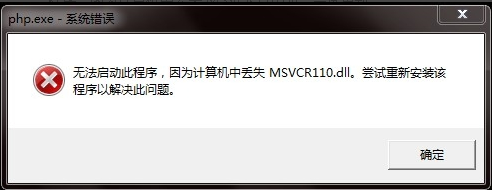
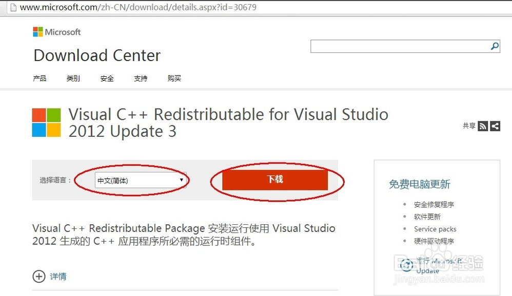
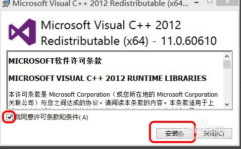

# 安装最新版WAMP时出现msvcr110.dll丢失问题
>*  wamp版本:Apache : 2.4.9 MySQL : 5.6.17 PHP : 5.5.12 PHPMyAdmin : 4.1.14 SqlBuddy : 1.3.3 XDebug : 2.2.5

运行LightMeeting项目的时候，[baby炼同学][1]告诉我可能是版本错误的原因，导致项目无法运行.(后来才发现不是这个原因,我摔).果断下载最新wamp,安装->运行,结果出现了下图的错误.

   ## 解决办法

 http://www.microsoft.com/zh-CN/download/details.aspx?id=30679 打开这个地址,去下载windows更新的链接库就可以了
 

 

 
 ### 选择相应的位数,我的机子是64bit.
 

 
 
 ### 傻瓜式安装！安装完之后会出现设置成功的图片！

- 如果我的方法不能解决你的问题,可以看[jayin][2]的[这篇博客][3]

 
 

  [1]: https://github.com/zhlhuang
  [2]: https://github.com/Jayin
  [3]: http://jayin.github.io/blog/index.html?tech/2014/2014-11-18-WAMP_setup_error.md