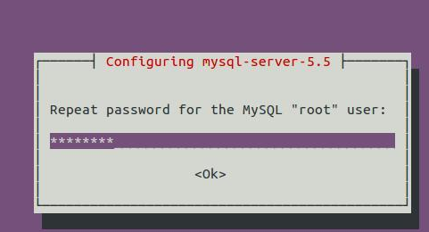
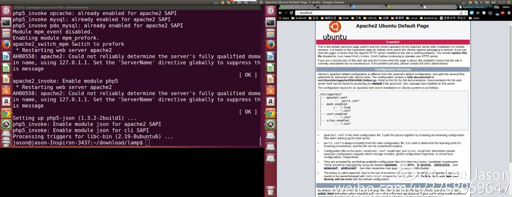

## Ubantu下安装Lamp服务器组件
>* Ubantu版本14.04 


### 第一步 安装LAMP

apt-get真是个伟大的发明

```
	sudo apt-get install lamp-server^ 
```

- 注意不要漏了最后的^！

apt包一般都要等待确认。输入Y,确认继续安装即可.

下载的途中，系统会提示你为MySQL的根用户设置密码.注意区分linux的Root用户跟MySQL的Root用户


输入密码后。系统会让你再次输入密码进行确认



确认密码后，apt会继续完成安装.


###第二步 测试Apache
安装完成之后，要做一些配置和测试，用来确认是否已经安装完成.

打开浏览器，输入```http://localhost/```,你会看到下面的网页.



### 第三步 测试php
>* 我就在这里踩坑了。

先用```su root ```进入根用户，然后输入以下终端命令
```
echo "<?php phpinfo(); ?>" | sudo tee /var/www/testing.php 
```

结果apache根本没法读取testing.php文件。出现类似以下的页面(因为本屌写博客的时候在win下，所以截图莫怪)


解决办法:

1.将工作目录转移到apache默认的根目录文件下面(**不推荐**),使用以下终端命令
假设目前工作目录在/home/username/phptest/var/www
```
	sudo ln -s/home/username/phptest/var/www/html
```
注：apache默认的工作目录就是html文件夹

2.改变Apache2的默认目录到当前的开发目录
**/etc/apache2/siste-enabled/00default** 
使用vim编辑该文件的DocumentRoot项，将**/var/www/html**改为**/var/www**

注：在root用户下编辑

3.之所以无法读取/var/www 目录下的文件，是因为linux的安全性原则，对文件的读写都做了限制。所以我们无法对www目录下的文件进行读写。只需要修改读写权限，同样可以在www目录下读取文件，在终端输入以下命令即可

```
	sudo chmod 777 /var/www
```


重启apache

```
sudo service apache2 restart 
```

接下来再在浏览器输入 ```http://localhost/testing.php```,就可以看到如下网页


### 小插曲

当你启动或者重新启动apache的时候，可能会看到如下信息

```
apache2: Could not reliably determine the server's fully qualified domain 
name, using 127.0.1.1 for ServerName 
```

1.使用如下命令搞定它，重新装载apache

```
echo "ServerName localhost" | sudo tee /etc/apache2/conf.d/fqdn 
```

```
sudo service apache2 reload 
```

之后你就再也看不到这个错误信息

2.如果上面的方法无效，找不到fqdn文件，可以这样

在**/etc/apache2/apache2.conf**文件后面加上

```#Server Name```

```ServerName 127.0.0.1```

### 第四步 配置MySql

因为是web环境，将mysql绑定到本地主机IP地址，默认情况下，这个地址应该是127.0.0.1.可以用输入以下命令进行确认

```
cat /etc/hosts | grep localhost 
``` 

你会看到类似这样的内容

```
127.0.0.1 localhost 
::1     ip6-localhost ip6-loopback 
```

然后确认一下MySQL的my.cnf文件中有正确的绑定地址

```
cat /etc/mysql/my.cnf | grep bind-address 
``` 

然后你会看到

```
bind-address = 127.0.0.1 
```

如果绑定地址有问题，需要在root用户下对**/etc/mysql/my.cnf**进行编辑纠正

### 第五步 安装phpMyAdmin

使用以下终端命令进行安装，当然如果你的SQL语句写的出神入化，当我没说

```
sudo apt-get install libapache2-mod-auth-mysql phpmyadmin 
``` 

老规矩，确认回车。

接下来会提示你选择为phpMyAdamin配置的web服务器。
使用键盘上的箭头选择apache，然后空格键，最后回车，继续进行，如图所示：


然后屏幕会问你是不是需要为phpMyAdmin配置一个名为dbconfig-common的数据库，选择"是"，然后回车.


下一个提示是为phpMyAdmin创建一个MySQL应用程序密码。如果按回车的话，创建的是一个随机性密码。我选择的是跟自己MySQL根密码同一个密码，因为这么封闭的开发环境，风险很小，虽然不是特别安全。


最后选择OK,一切搞定

### 第六步 测试phpMyAdmin
这一步简单到没朋友。打开浏览器 输入```http://localhost/phpmyadmin/```，可以看到如下页面


最后以用户名root和之前创建的跟密码来进行登录即可


