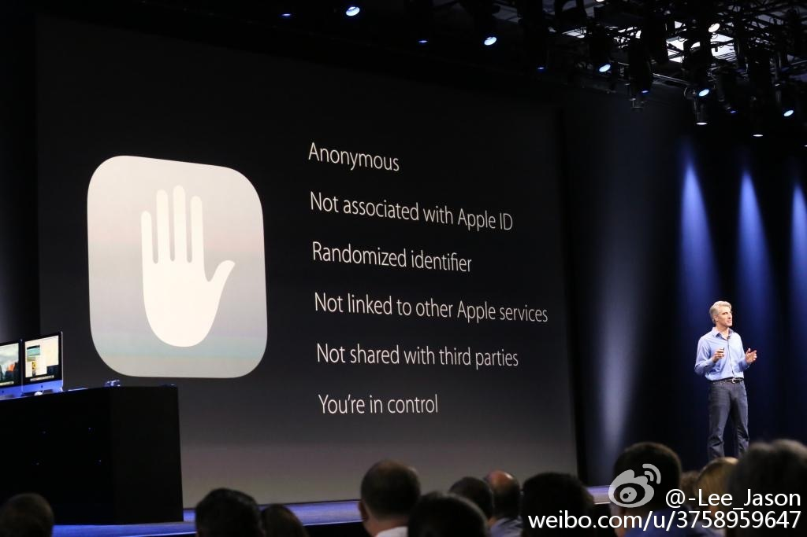

# About Me

## Jason Lee

> 理解（りかい）されるということは、一種（いっしゅ）の贅沢（ぜいたく）である。

## Major
- Java
- Android develops
- Maybe cocos2d-x 
- cpp & c

## College Studying In

CS College in WYU, China

## [我的简历](myresume.md)

## On Github

[@jacsonLee](https://github.com/jacsonLee)

## FriendLink
>* some excellent people's Blog 

[JayinTon](http://jayinton.com/blog/index.html)

[skyhacker2](http://my.oschina.net/skyhacker2/blog)

[Fritx](http://fritx.github.io/blog/)

[huangruichang](http://huangruichang.github.io/)

[ankerjam](http://ankerjam.sinaapp.com/)