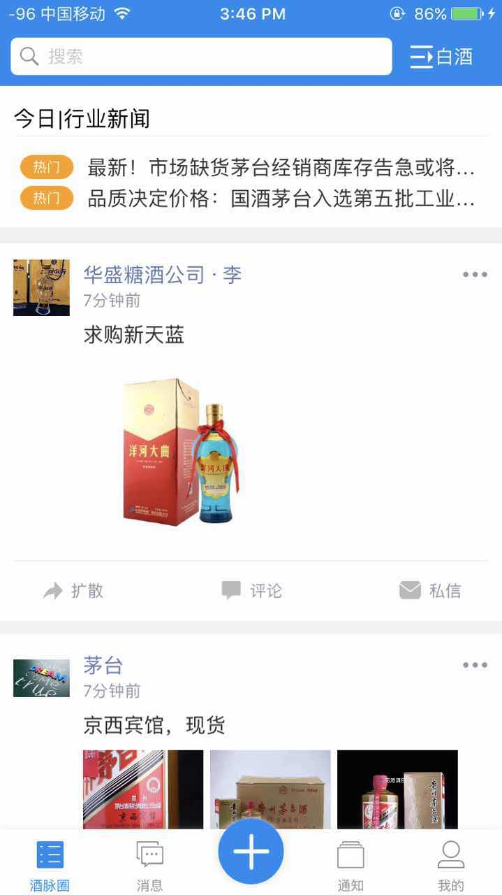
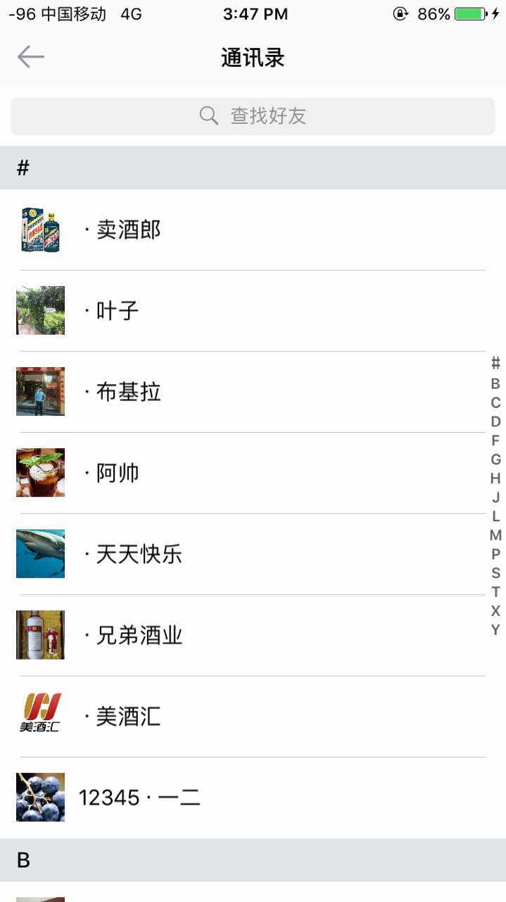
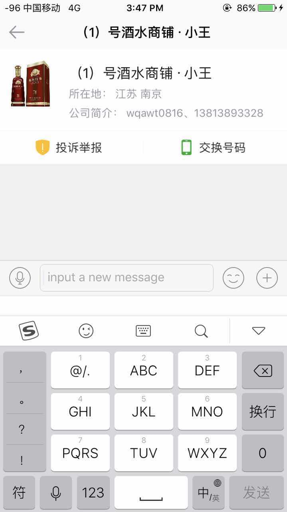
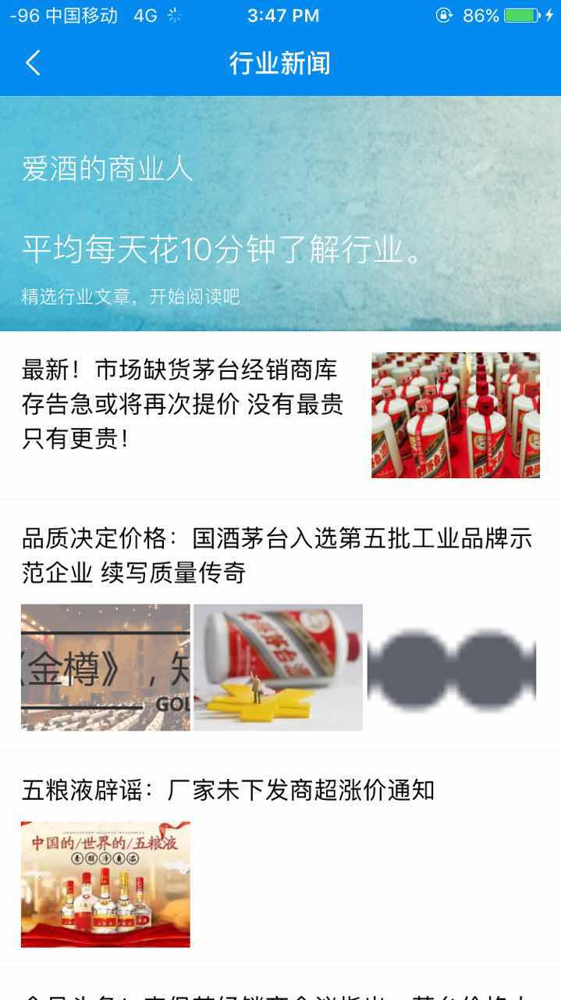
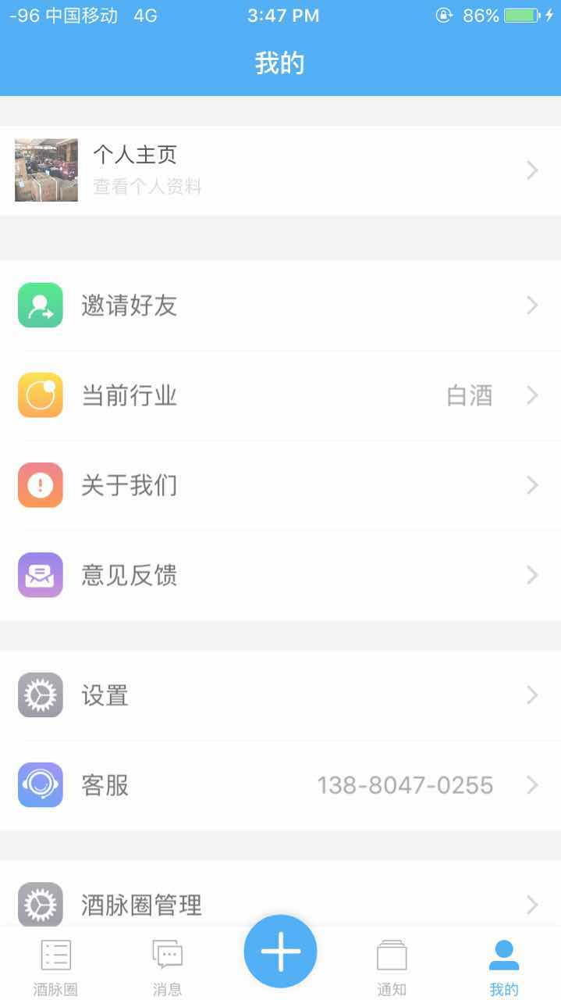
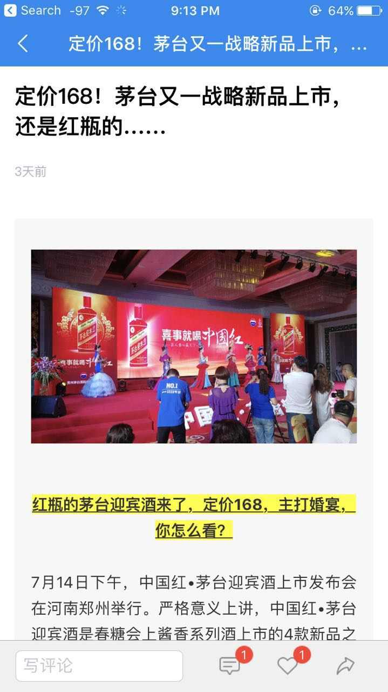
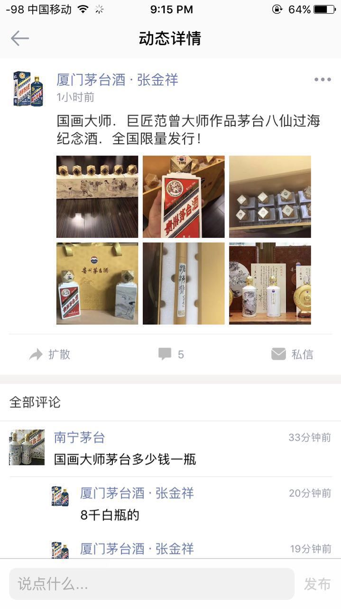
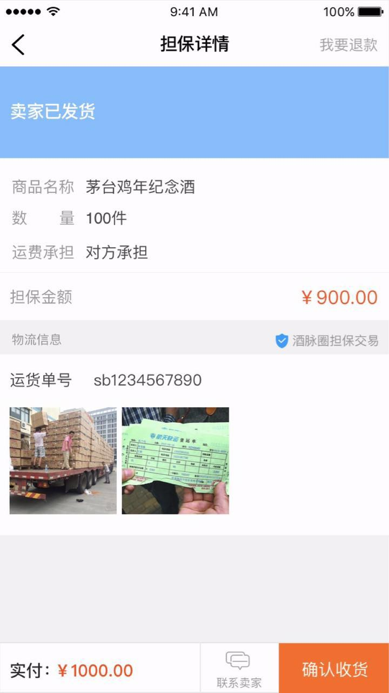

# 酒脉圈App

## 产品简介
这是一款服务于糖酒食品行业的酒类B2B交易软件。是我和三个同伴从0到1历经一年做起来的项目，目前用户近2万，每天新闻阅读量pv日均10万，虽然量不大，但是都是B端商户。

## 功能

- 酒类信息发布
- IM单聊群聊
- 酒业新闻阅读
- 用户通讯录
- 个人中心管理
- 交易资金担保

## 项目截图

&nbsp;

&nbsp;

&nbsp;

&nbsp;

&nbsp;

&nbsp;

## 下载地址

下载地址：http://a.app.qq.com/o/simple.jsp?pkgname=com.wl.winelovers