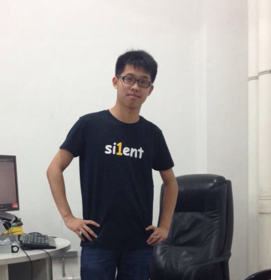

# 我的简历

*2015-06-15*

## 基本信息

<table>
  <tbody>
    <tr>
      <td>姓名</td><td>李志雄</td>
      <td colspan="2" rowspan="5" style="text-align:center">
        
      </td>
    </tr>
    <tr>
      <td>手机</td><td>188\*\*\*\*2436</td>
    </tr>
    <tr>
      <td>电子邮箱</td><td>lizhixiong498056754@gmail.com</td>
    </tr>
    <tr>
      <td>QQ</td><td>782394631@qq.com</td>
    </tr>
    <tr>
      <td>个人主页</td><td>[Jason's Blog](http://jacsonlee.github.io/)</td>
    </tr>
    <tr>
      <td>性别</td><td>男</td><td>出生年月</td><td>1993-06</td>
    </tr>
    <tr>
      <td>学历</td><td>本科</td><td>院校</td><td>五邑大学</td>
    </tr>
    <tr>
      <td>自我评价</td><td>A boy who want to make world a better place</td><td>目前</td><td>大二在读</td>
    </tr>
  <tbody>
</table>

## 个人技能

- Java/Android(熟悉)
- PHP(主thinkphp框架,可以写后端业务逻辑，玩过onethink模板引擎)
- Python(会写爬虫,懂Flask,Requests，刚开始玩BeautifulSoup)
- 懂基础的html，css，js，玩过nodejs(试手做过一个音乐可视化的音乐播放器，后端express+ejs，前端js)

## 期望工作

| 地点 | 职型 | 职位 | 空闲区间 |
| :-: | :-: | :-: | :-: |
| 广州 | 实习 | Android开发 | 大二暑假 |

## 项目经验

- 2014年09月参与东莞技能培训APP开发
- 2014年11月参与轻会议android客户端开发
- 2015年3月参与约运动android客户端
- 2015年5月参与汇慧App的校内推广工作以及部分前端功能的开发
- 2015年6月写一个抓取很多东西的网络爬虫，代码托管在[coding.net](https://coding.net/u/coder_jason/p/PythonSpider/git)还有一个抓取知乎的[爬虫](https://coding.net/u/coder_jason/p/PythonSnatchAt/git)

## 简单补充

- 时间紧急，还没来得及整理项目，可以看下[这篇文章](http://jacsonlee.github.io/Blog/?Diary/zheduanshijian),看下就好，别太认真,平时写的东西很多托管在[我的github](https://github.com/jacsonLee)或者[coding.net](https://coding.net/user)

